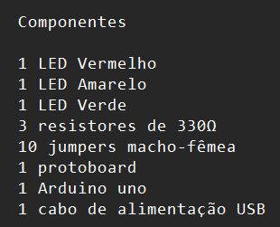
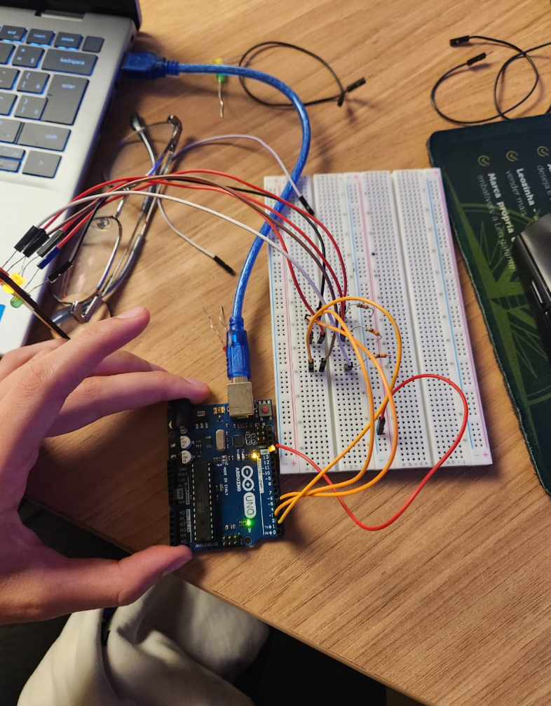

# Ponderada de programação: semáforo offline

## Montagem
**link do video:**
https://youtube.com/shorts/pRncZ-GuOEc

1. Primeiro eu separei os componentes necessarios, que são: 
<p align="center">
  
</p>

2. Depois foi feita a montagem, ligando os terminais negativos dos LEDS, diretamente na linha terra da protoboard que está conectada ao GND do Arduino. Os terminais possitivos dos LEDS foram ligados nos pinos 2, 3 e 4 no Arduino (vermelho no 2, Amarelo no 3 e verde no 4) e essa ligação foi feita por meio dos resistores.

<p align="center">
  
</p>

## Tabelas de Avaliação entre Pares

#### Avaliador: Livia Oliveira

|Critério|	Contempla (Pontos)|	Contempla Parcialmente (Pontos)	|Não Contempla (Pontos)	|Observações do Avaliador|
|-|-|-|-|-|
|Montagem física com cores corretas, boa disposição dos fios e uso adequado de resistores	|Até 3	|Até 1,5	|0 | Estava facil de entender e vizualizar |
|Temporização adequada conforme tempos medidos com auxílio de algum instrumento externo	|Até 3	|Até 1,5	|0 | Foi medido com o conometro do celular e estavá certo|	
|Código implementa corretamente as fases do semáforo e estrutura do código (variáveis representativas e comentários) |	Até 3|	Até 1,5 |	0 | Contem comentarios diretos e simples de entender |	
|Ir além: Implementou um componente de extra, fez com millis() ao invés do delay() e/ou usou ponteiros no código |	Até 1 |	Até 0,5 |	0 | Fez com o Millis no lugar do delay|	
| | | | |Pontuação Total: 10|

#### Avaliador: Rafael Santana

|Critério|	Contempla (Pontos)|	Contempla Parcialmente (Pontos)	|Não Contempla (Pontos)	|Observações do Avaliador|
|-|-|-|-|-|
|Montagem física com cores corretas, boa disposição dos fios e uso adequado de resistores	|Até 3	|Até 1,5	|0 | Estava montado corretanete e de forma simples |	
|Temporização adequada conforme tempos medidos com auxílio de algum instrumento externo	|Até 3	|Até 1,5	|0 | Foi medido com o conometro do celular e estava no tempo certo|	
|Código implementa corretamente as fases do semáforo e estrutura do código (variáveis representativas e comentários) |	Até 3|	Até 1,5 |	0 | O contigo estava bem estruturado e estava comentado|	
|Ir além: Implementou um componente de extra, fez com millis() ao invés do delay() e/ou usou ponteiros no código |	Até 1 |	Até 0,5 |	0 | Fez o uso do millis |	
| | | | |Pontuação Total: 10|

## Código
```cpp

// Define os pinos correspondentes a cada LED
int RED = 2;
int YELLOW = 3;
int GREEN = 4;

// Define os tempos (em milissegundos) para cada cor do semáforo
unsigned long DELAY_RED = 6000;

unsigned long DELAY_YELLOW = 2000;  

unsigned long DELAY_GREEN = 4000;   

// Armazena o tempo da última troca de estado do semáforo
unsigned long previousMillis = 0;

// Controla o estado atual do semáforo
int state = 0;

void setup() {
  // Configura os pinos como saídas digitais
  pinMode(GREEN, OUTPUT);
  pinMode(YELLOW, OUTPUT);
  pinMode(RED, OUTPUT);
}

void loop() {
  // Captura o tempo atual desde que o Arduino foi iniciado
  unsigned long currentMillis = millis();

  // Estrutura de controle que define o comportamento do semáforo
  switch (state) {

    case 0:
      // Estado 0: acende o vermelho
      red_light();
      // Verifica se o tempo do vermelho já passou
      if (currentMillis - previousMillis >= DELAY_RED) {
        previousMillis = currentMillis; 
        state = 1; // Muda para o próximo estado (amarelo)
      }
      break;

    case 1:
      // Estado 1: acende o amarelo
      yellow_light();
      // Verifica se o tempo do amarelo já passou
      if (currentMillis - previousMillis >= DELAY_YELLOW) {
        previousMillis = currentMillis;
        state = 2; // Muda para o próximo estado (verde)
      }
      break;

    case 2:
      // Estado 2: acende o verde
      green_light();
      // Verifica se o tempo do verde já passou
      if (currentMillis - previousMillis >= DELAY_GREEN) {
        previousMillis = currentMillis;
        state = 0; // Volta para o vermelho (reinicia o ciclo)
      }
      break;
  }
}

// Liga apenas o LED vermelho
void red_light() {
  digitalWrite(RED, HIGH);
  digitalWrite(YELLOW, LOW);
  digitalWrite(GREEN, LOW);
}

// Liga apenas o LED amarelo
void yellow_light() {
  digitalWrite(YELLOW, HIGH);
  digitalWrite(RED, LOW);
  digitalWrite(GREEN, LOW);
}

// Liga apenas o LED verde
void green_light() {
  digitalWrite(RED, LOW);
  digitalWrite(GREEN, HIGH);
  digitalWrite(YELLOW, LOW);
}